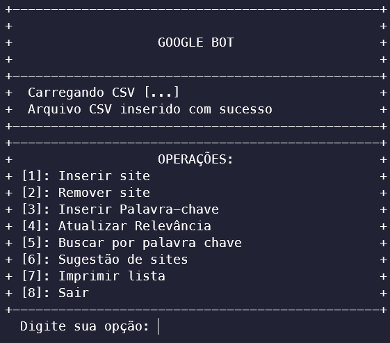

# MINI GOOGLEBOT
Projeto para a matéria SCC0202 - Algoritmos e Estruturas de Dados 1

## Autores:
- [Diógenes Silva Pedro](github.com/D10g3n3s) - nUSP 11883476
- [Alexandre Lima Palles Rocha](https://github.com/Alexandre-Palles) - nUSP 11797038

## Compilador:
Foi utilizado o padrão C99 para o projeto, além do compilador GCC (Gnu C Compiler).

## Estruturas Utilizadas:
O programa simula o googlebot, um banco de dados com informações sobre sites. Para o funcionamento do programa utilizamos duas estruturas de dados diferentes, uma árvore AVL e uma lista ligada. Alguns pontos sobre cada estrutura.
- ### Árvore AVL:
    - Árvores são estruturas de dados não lineares. O que ajudam na complexidade das operações tornardo-as logarítmicas.
    - Árvores AVL são um tipo especial de árvore binária de busca, para que uma ABB seja considerada uma árvore AVL, as alturas das sub árvores de um nó não podem diferenciar em mais de 1. Para calcularmos esse fator de balanceamento de um nó temos que: 
        - FB = altura(node->left) - altura(node->right)
    - Quando conseguimos uma árvore AVL temos a vantagem nas operações de busca. Como estamos rebalançando a árvore a cada inserção ou remoção a altura de nosso árvore muda, consequentemente, o número de operações de busca diminui, mesmo a complexidade para as buscas mesmo continuando em O(log(n)).
    - Em inserções e remoções temos uma complexidade de O(log(n)) pois é necessário andar por cada nó um uma altura da árvore até acharmos o local necessário. Mesmo que tenhamos que fazer as rotações, nas operações de inserção, e o balanceamento, nas operações de remoção.
    - Em resumo podemos dizer que com uma árvore AVL temos a vantagem de ter uma complexidade O(log(n)) nas operações de inserção, remoção e busca. Relembrando que não será necessário fazermos rotações em todas as inserções, nem balancearmos em todas as remoções.
- ### Lista Ligada:
    - Listas são estruturas de dados lineares. Dado a essa lineariedade as operações tendem a ter uma complexidade O(n). Porém precisamos analisar alguns casos.
    - Se utilizarmos uma lista ligada encadeada podemos ter uma inserção e remoção em O(n), quando fazemos uma lista ordenada. Porém podemos fazer um caso onde a inserção se dá sempre no fim da lista assim essa terá O(1).
    - Buscas e remoções tendem a ser O(n), se tivermos uma lista não ordenada será necessário iterar por toda a lista procurando o elemento a ser removido. Nos casos de listas ordenadas a complexidade ainda continua sendo O(n), porem podemos nos utilizar da ordenação para fazermos menos operações.

## Onde e como essas estruturas estão sendo utilizadas?
- ### Árvore AVL:
    - Foi utilizada essa estrutura para salvar os sites, assim além de termos os sites sendo inseridos, removidos e buscados em complexidade O(log(n)), que são operações mais rápidas, ainda nos aproveitamos do fato de árvores binárias de buscas serem ordenadas, com elementos a esquerda de um nó como sendo elementos menores e elementos a direita desse mesmo nó como sendo elementos maiores.
    - Quando printamos a árvore em ordem temos os elementos ordenados, baseado no padrão da implementação da inserção.
- ### Lista Ligada:
    - Foi utilizada a lista ligada nas funções de buscar sites baseados em uma palavra chave, além da função de sugestão de sites baseado em uma lista de sites baseada em uma palavra chave. Não foi utilizada uma árvore para isso pois poderiamos ter 2 sites com mesma relevância e com isso quebrariamos a propriedade de uma árvore binária ter chaves distintas, no nosso caso a chave seria a relevância.

## Uso do programa:

O programa inicia carregando uma lista de sites predefinida e mostra um menu com as opções:
- Inserção:
    - Inserção CSV: O usuário passa o nome de um arquivo de texto no tipo CSV para salvar os dados na lista.
    - Inserção manual: O usuário escreve uma linha, no estilo CSV, para ser salva na lista.
    - Essas funções procuram por um código já existente na lista, caso esse não exista os sites são adicionados na lista. Utilizamos de 1 busca e 1 inserção para cada site com código inexistente na lista. Pode ser que tenhamos que fazer uma rotação porém isso não acontece em todas as inserções.
- Remoção:
    - O programa pede para o usuário o código de um site existente para removê-lo da lista.
    - Essa função faz 1 busca para achar o site com código existente e a remoção. Pode ser que tenhamos que fazer um balanceamento porém não acontece em todas as remoções.
- Inserir Palavra-chave:
    - O usuário passa um código válido e uma palavra válida para ser adicionada como palavra chave de um site.
    - Essa função faz 1 busca pelo código, se acharmos o site com o código podemos adicionar um nova palavra chave ao site achado, porém o site tem que ter menos de 10 palavras chaves. Assim faremos 1 busca na árvore e na maior parte dos casos 1 inserção de palavra chave.
- Atualizar Relevância:
    - O usuário passa um código válido e uma relevância para atualizar a relevância de um site.
    - Essa função faz 1 busca pelo código, se acharmos o site com o código podemos atualizar a revelância do site. Assim faremos 1 busca na árvore e 1 função para alteração da relevância.
- Buscar por palavra chave:
    - O usuário para uma palavra a ser buscada em toda a lista, depois da busca o programa printa uma lista com os sites que contenham a palavra chave, caso essa lista não seja vazia.
    - Essa função faz uma busca por todos os elementos da árvore caso as palavras chave do site atual contenha a palavra chave buscada, adicionaremos o ponteiro do site a lista dos sites. Assim faremos a busca em toda a árvore e n funções de inserção na lista, sendo n o número de sites que contenham a palavra chave buscada. 
- Sugestão de Site:
    - O usuário digita uma palavra, após criarmos uma lista dos sites que existem a palavra chave, iteraremos pela lista e olharemos todas as palavras chaves existentes em todos os sites para criarmos uma lista de sugestão de sites, depois printaremos os 5 sites mais relevantes para o usuário.
    - Essa função terá uma complexidade de O(n²), onde n é o número de elementos da lista e k será o número de palavras chave únicas na lista de site criada pela função de busca por palavras chave.
- Imprimir Lista:
    - O programa printa todos os sites da lista. Essa função itera por toda a lista printando cada nó, mostrando todos os sites em ordem crescente dos códigos.
- Sair:
    - O programa fecha liberando toda a memória alocada para a árvore, listas e sites.